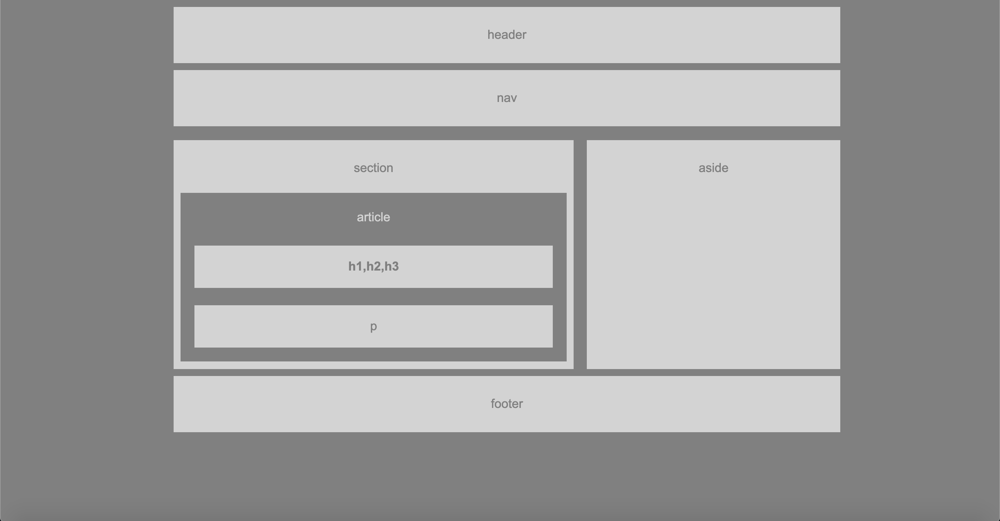

# HW-Wireframe

## Summary

This contains the Wireframe homework.

## Site Picture




## Technologies Used
    -HTML - used to create the base structure of the Wireframe.
    -CSS - styles are used to create the set up of the page.
    -Git - version control system to track changes to source code.
    -GitHub - hosts repository that can be deployed to GitHub page.


## Code Snipit

    This snipit is used to center the basic structure of the content. 

```css
body{
    font-family: Arial, Helvetica, sans-serif;
    color: #777;
    background-color: gray;
    width: 960px;
    font-size: 18px;
    margin: 10px 250px;
}


